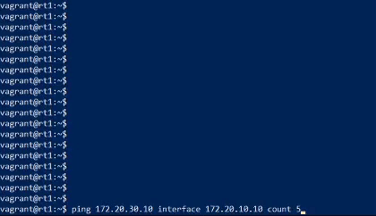
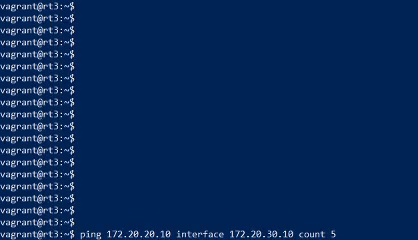
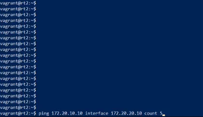

# VyOS OSPF Practical Activity
### Task description
You have the following topology:
```

                     +-----+
172.20.10.10---eth2--| rt1 |--eth1--10.10.0.10--+
                     +-----+                    |
                                                |
                                                | 
                     +-----+                    |
172.20.20.10---eth2--| rt2 |--eth1--10.10.0.20--|--10.10.0.0/24
                     +-----+                    |
                                                |
                                                |
                     +-----+                    |
172.20.30.10---eth2--| rt3 |--eth1--10.10.0.30--+
                     +-----+
```

Your objective is to configure OSPF between rt1/rt2/rt3 to enable connectivity between 172.20.x.0/24 networks.
#### 0. Setup VirtualBox
Download from https://www.virtualbox.org/wiki/Downloads and install
#### 1. Setup Vagrant
Download from https://www.vagrantup.com/downloads.html and install
#### 2. Pull repository
```git clone https://github.com/Astrarog/hse-vyos-ospf.git```
#### 3. Setup environment
```
cd hse-vyos-ospf
vagrant up
```
#### 4. Configure virtual routers
Note:  The password is "vagrant".

##### Configure hostnames and ip adresses

<table>
<tr>
<th>
<pre>
+-----+
| rt1 |
+-----+
</pre>
</th>
<th>
<pre>
+-----+
| rt2 |
+-----+
</pre>
</th>
<th>
<pre>
+-----+
| rt3 |
+-----+
</pre>
</th>
</tr>
<tr>
<td>
<code>
<pre>
vagrant ssh rt1
configure


set system host-name rt1
set interfaces ethernet eth1 address 10.10.0.10/24 
set interfaces ethernet eth2 address 172.20.10.10/24 

commit
save
</pre>
</code>
</td>
<td>
<code>
<pre>
vagrant ssh rt2
configure


set system host-name rt2
set interfaces ethernet eth1 address 10.10.0.20/24 
set interfaces ethernet eth2 address 172.20.20.10/24 

commit
save
</pre>
</code>
</td>
<td>
<code>
<pre>
vagrant ssh rt3
configure


set system host-name rt3
set interfaces ethernet eth1 address 10.10.0.30/24 
set interfaces ethernet eth2 address 172.20.30.10/24 

commit
save
</pre>
</code>
</td>
</tr>
</table>


##### Configure ospf areas

<table>
<tr>
<th>
<pre>
+-----+
| rt1 |
+-----+
</pre>
</th>
<th>
<pre>
+-----+
| rt2 |
+-----+
</pre>
</th>
<th>
<pre>
+-----+
| rt3 |
+-----+
</pre>
</th>
</tr>
<tr>
<td>
<code>
<pre>
set protocols ospf area 0 network 10.10.0.0/24
set protocols ospf parameters router-id 10.10.0.10
set protocols ospf area 1 network 172.20.10.0/24

commit
save
exit
</pre>
</code>
</td>
<td>
<code>
<pre>
set protocols ospf area 0 network 10.10.0.0/24
set protocols ospf parameters router-id 10.10.0.20
set protocols ospf area 2 network 172.20.20.0/24

commit
save
exit
</pre>
</code>
</td>
<td>
<code>
<pre>
set protocols ospf area 0 network 10.10.0.0/24
set protocols ospf parameters router-id 10.10.0.30
set protocols ospf area 3 network 172.20.30.0/24

commit
save
exit
</pre>
</code>
</td>
</tr>
</table>


#### 5. Validate

<table>
<tr>
<th>
<pre>
+-----+                        +-----+
| rt1 |--eth2--- OSPF ---eth2--| rt3 |
+-----+                        +-----+
</pre>
</th>
<th>
<pre>
+-----+                        +-----+
| rt3 |--eth2--- OSPF ---eth2--| rt2 |
+-----+                        +-----+
</pre>
</th>
<th>
<pre>
+-----+                        +-----+
| rt2 |--eth2--- OSPF ---eth2--| rt1 |
+-----+                        +-----+
</pre>
</th>
</tr>
<tr>
<td>

</td>
<td>

</td>
<td>

</td>
</tr>
</table>

#### 6. Destroy VMs
```vagrant destroy```
